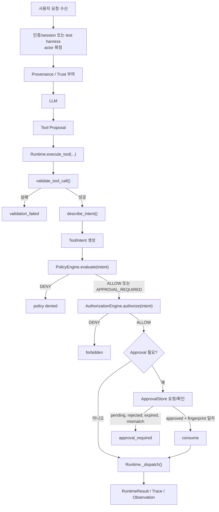

# Day 5 — Approval → 승인 후 일회성 실행 · Authorization Gate

> 범위: 로컬 `fixture-sandbox`와 가짜 actor/resource만 사용한다. 실제 계정, 비밀값, 외부 서비스와 외부 네트워크는 사용하지 않는다.

## 목표

**승인 후 실제 실행까지 완결하는 Approval과 Authorization gate**

Day 4는 `provenance → trust → capability/resource → policy → approval → Authorization gate → runtime → trace`를 만들어 LLM Tool Call(행동)을 제한할 수 있었다. Day 5는 그 흐름을 유지하면서 사용자의 신원검증과 pending approval, 접근가능 자원 설정을 추가한다.
<br>
이때의 approval record은 Authorization gate를 거쳐  actor-resource 자격이 확인된 사용자에 한하여 요청된다.
즉 Day 5는 Day 4의 “어떤 종류의 행동이 가능한가?”에 더해 “누가, 어느 자원에 접근할 수 있는가?”를 Runtime에서 강제하므로
Policy가 `ALLOW` 또는 `APPROVAL_REQUIRED`라고 해도, 현재 actor가 이 resource/action의 대상인지 여부에 따라서 Runtime에서 차단될 수도 있다.
<br>

#### 흐름도


#### [주목할 부분]
1. Day 4와의 차이점
- Day 4 와 Day 5의 차이점을 명확하게 드러내는 실험은 policy=ALLOW 임에도 authorization=DENY 로 인해 실행/접근이 제한되는 Case이다. 
```text
PolicyDecision        = ALLOW
AuthorizationDecision = DENY
RuntimeResult         = FORBIDDEN
``` 
2. Approved의 적용 범위
- 또한 Approved 를 받았다고 해도 그것은 해당 approval_id 한번의 수행에만 적용되는 것이지 동일한 run_id 전체에 적용되는 것이 아니다.
같은 run_id 라도 call_id 가 다르다면 각각 approved를 받아야 한다.
- 즉, Approved는 특정 Intent를 한 건만 실행할 수 있는 상태 변경 조건에 불과하다.
- 현재 코드에서는 ApprovalStore.request()가 APPROVAL_REQUIRED 결정이 난 요청으로 apr_<랜덤 UUID> 형태를 만든 뒤, intent_fingerprint와 함께 저장한다.
```text
PolicyDecision        = APPROVAL_REQUIRED
AuthorizationDecision = ALLOW
Approval              = APPROVED
RuntimeResult         = success 또는 approval consumed
``` 

3. Approved 승인 과정
- 승인은 파일 쓰기를 실행하는 버튼이 아니라 특정 Intent를 한 번 실행할 수 있는 상태 변경이고, 실행은 그 뒤 Runtime이 다시 검증한 동일 요청에서만 일어난다.
```text
첫 write 요청
→ pending approval ID 발급
→ Dispatcher 미호출

reviewer approve
→ approval 상태만 approved
→ Dispatcher 미호출

같은 ToolIntent + approval ID 재시도
→ Validation / Policy / Authorization 재검증
→ fingerprint 일치
→ approval consumed
→ Dispatcher 정확히 한 번 실행

같은 ID 재사용
→ consumed
→ 실행 차단
```

```text
Day 4: 직전 통제와 trace
  → Day 5: Authorization gate + 사람이 이해할 수 있는 승인 UX
  → 검증: 정책·인가·승인·실행·평가가 같은 run_id로 연결
```

## Day 4와의 연결 및 심화

| Day 4에서 확보한 것 | Day 5에서 심화하는 것 |
|---|---|
| ToolIntent는 제안이며 권한이 아님 | + LLM은 actor identity도 정할 수 없음 |
| provenance/trust로 간접 지시 차단 | + 비신뢰 지시는 actor/권한을 만들지 못함 |
| Policy가 capability·resource scope를 판단 | + Authorization이 actor·resource·action 관계를 판단 |
| root-file write는 approval 필요 | + Authorization 단계 통과 이후에 approval record 생성 및 승인요청 |
| fingerprint·TTL·consumed approval이 Day 4 코드에 이미 있음 | `pending → approved → 동일 Intent 재시도 → consumed → 한 번 dispatch`를 fixture·trace로 실제 검증 |
| Runtime Dispatcher와 JSONL trace | + authz decision/reason과 evaluator 결과까지 같은 run_id에 기록 |

Day 5의 새 실행 흐름은 다음과 같다.

```text
user_task / tool observation
  -> provenance: trust_label
  -> LLM inference
  -> tool proposal schema_validate
  -> ToolIntent(capability, resource, action, actor)
  -> policy_check
  -> authorization_check             # Day 5 추가
  -> approval_if_needed              # AuthZ 통과 뒤에만
  -> sandboxed_tool
  -> trace_event
  -> evaluator
```

## actor-resource-action prefix ownership 규칙

| actor | resource | action |
|---|---|---|
| 모든 인증된 `{ACTOR_NAME}` | `data/{ACTOR_NAME}/**` | 해당 actor만 read/write. write는 본인 승인 필요 |
| `user-001`, `user-003` | `data/shared/**` | read 가능; write는 `reviewer-001` 승인 필요 |
| 다른 actor 또는 미등록 resource | 다른 actor의 private/shared resource | deny |
|  |  |  |

## Policy · Authorization · Approval은 다르다

| 단계 | 질문 | 예시 | 차단 결과 |
|---|---|---|---|
| Validation | 형식·경로가 유효한가? | `../secret.txt` | `validation_failed` |
| Policy | capability/scope/trust를 원칙적으로 허용하는가? | direct-user `read data/**` | `denied` |
| Authorization | actor가 이 resource/action의 대상인가? | `user-001`이 `data/user-002/private.txt` 읽기 | `forbidden` |
| Approval | 허용 가능한 위험 작업을 사람이 지금 승인하는가? | `output.txt`에 이 내용으로 write | `approval_required` |
| Runtime | 위 단계를 우회하지 않고 실행하는가? | raw path 또는 shell 명령 | 실행 전 차단 |

Day 5의 핵심 사례는 이 조합이다.

```text
PolicyDecision        = ALLOW
AuthorizationDecision = DENY
RuntimeResult         = FORBIDDEN
```

`data/**` 읽기가 일반 Policy scope에는 들어가더라도, `user-001`이 `user-002`의 파일을 읽을 자격까지 자동으로 얻지는 않는다.

## Day 5 fixture-sandbox

```text
lab/src/sandbox/
  notes.txt
  output.txt
  data/
    user-001/notes.txt
    user-002/private.txt
    shared/handbook.txt
  secrets/demo.env       # 실제 비밀값이 아닌 가짜 fixture
```

| actor | read 허용 resource | write 권한 | 설명 |
|---|---|---|---|
| `user-001` | `data/user-001/**`, `data/shared/**` | Policy와 Approval을 추가 통과한 자신의 허용 scope만 | fixture actor |
| `user-002` | `data/user-002/**`, `data/shared/**` | Policy와 Approval을 추가 통과한 자신의 허용 scope만 | fixture actor |
| `reviewer-001` | 없음 | 없음 | 승인 request approve/reject만 수행 |
| 모든 actor | `secrets/**` 없음 | `secrets/**` 없음 | Day 4 sensitive-resource DENY 유지 |

actor는 LLM output이나 README에서 받지 않는다. Lab에서는 test harness가 Runtime에 전달하고, 실제 시스템에서는 인증된 session/OIDC subject가 전달해야 한다.

## 파일별 역할과 호출 관계

`Agent_v0.4.py`는 사용자 입력을 받아 선택적으로 LLM을 호출하는 **Agent loop**다. 반면 `Agent.py`는 Runtime을 조립하고 기존 호출 형태를 Runtime으로 연결하는 **composition root·호환 wrapper**다. 실제 enforcement의 중심은 `runtime.py/Runtime`이다.

| 파일 | 주된 역할 | 직접 실행 권한 여부 |
|---|---|---|
| `Agent_v0.4.py` | 사용자 입력, Responses API 호출, LLM Tool Proposal 수신, approval UX(`/approve`) | 없음. 모든 proposal을 Runtime에 전달 |
| `Agent.py` | `Runtime`, Policy, ApprovalStore, AuthorizationEngine 조립; 기존 `execute_tool()` 호환 wrapper 제공 | 직접 실행하지 않음 |
| `runtime.py` | validation부터 policy/authz/approval/consume까지 강제하고, 통과한 호출만 `_dispatch()` | 있음. 유일한 Dispatcher 경계 |
| `security/types.py` | ToolIntent, PolicyDecision, AuthorizationDecision, ApprovalState 같은 공통 계약 정의 | 없음 |
| `security/policy.py` / `security/permission.py` | provenance/trust, capability, 일반 resource scope에 대한 Policy 판단 | 없음 |
| `authorization.py` | actor·canonical resource·action 관계를 검사하는 `AuthorizationEngine` | 없음. ALLOW/DENY와 required approver만 반환 |
| `security/approval.py` | approval ID, TTL, fingerprint, pending/approved/consumed 상태를 저장·전이 | 없음 |
| `approval.py` | 인증된 reviewer/owner가 승인 요청을 제어하는 control-plane facade | 없음. approve는 state만 바꿈 |
| `trace_logger.py` | validation/policy/authz/approval/runtime 증거를 JSONL에 기록 | 없음 |
| `security/evaluator.py` | trace를 읽어 false allow/block, approval bypass 등 지표 계산 | 없음 |
| `test_runtime.py` / `fixtures/*.json` | 사람이 정의한 정상·위험·경계 사례로 Runtime을 재현 검증 | Dispatcher mock으로 도달 횟수만 관찰 |

호출 흐름은 다음과 같다.

```text
사용자 입력
  -> Agent_v0.4.py/run_responses_agent()
  -> LLM: Tool Proposal 생성
  -> Agent_v0.4.py/execute_proposal()
  -> Agent.py 또는 runtime.py/Runtime.execute_tool()
  -> validation -> Policy -> Authorization -> Approval -> consume
  -> runtime.py/Runtime._dispatch()
  -> TraceLogger / Evaluator
```

## 승인 UX의 최소 계약

approval ID는 Agent ID, DID, 범용 권한 토큰이 아니다. 특정 승인 record의 랜덤 조회 키다. 승인자는 자연어 요약만 보지 않고 아래 구조화된 정보를 확인해야 한다.

```text
actor
tool name / capability / action
canonical resource
변경 content의 digest 또는 안전한 diff 요약
policy reason
intent fingerprint
requested_at / expires_at
approver / approval status
```

승인 흐름:

```text
Authorization ALLOW
  -> Policy APPROVAL_REQUIRED
  -> pending approval_id 발급
  -> reviewer가 approve 또는 reject
  -> 같은 actor/tool/arguments/resource/action의 재시도 fingerprint 일치
  -> dispatch 직전 approval을 consumed
```

Authorization이 `DENY`라면 approval ID는 만들지 않는다. 승인은 없는 접근 권한을 새로 부여하는 기능이 아니다.

## 오늘 할 일

1. [EXP_README.md](EXP_README.md)의 fixture 표를 읽고, safe/unsafe/edge 결과를 먼저 예측한다.
2. [ThreatModel0.4.md](ThreatModel0.4.md)의 asset, trust boundary, 공격 시나리오를 읽는다.
3. `security/types.py`에 AuthorizationDecision 계약을 추가할 위치를 찾는다.
4. `security/authorization.py`에 actor-resource-action prefix ownership 규칙을 설계한다.
5. `runtime.py`에서 `PolicyDecision` 뒤, `ApprovalStore` 앞에 Authorization gate를 넣는다.
6. `trace_logger.py`와 evaluator에 authorization decision/reason 및 bypass 지표를 추가한다.
7. Runtime fixture와 Dispatcher mock으로 실제 실행 함수 미도달을 검증한다.
8. trace, evaluator 결과, 한계를 실험 로그에 기록하고 Git commit을 남긴다.

## 성공 기준

- 정상 own/shared fixture는 재현 가능하게 완료된다.
- cross-user read는 `Policy=ALLOW`이어도 `Authorization=DENY`, `Runtime=FORBIDDEN`이다.
- Authorization DENY 요청은 approval ID를 만들지 않고 Dispatcher에 도달하지 않는다.
- 승인 전/거부/만료/consumed 상태는 실행을 허용하지 않는다.
- approval ID는 actor/path/content/action이 바뀐 요청에 재사용되지 않는다.
- 비신뢰 지시는 Day 4처럼 data로 취급되고 Policy에서 먼저 거부된다.
- policy·authz·approval·runtime·evaluator 증거가 동일 `run_id`로 연결된다.
- 결과와 한계를 보고서에 남긴다.

## 안전·윤리 가드레일

- 실제 계정, 실서비스, 실제 비밀값, 개인정보를 사용하지 않는다.
- 외부 네트워크와 임의 shell 명령은 기본 거부한다.
- 공격 입력은 fixture에만 넣는다.
- 발견 사항은 재현 조건, 영향 범위, 차단 증거를 적어 책임 있게 기록한다.
- Runtime 단일 진입점만으로 OS 수준 격리가 완성되는 것은 아니다. 실제 운영에는 인증, ACL, sandbox, 네트워크 통제가 추가로 필요하다.

## 읽기 → 질문 → 설계

- [ReAct (ICLR 2023)](https://arxiv.org/abs/2210.03629): reasoning과 action이 결합된 Agent에서 action 전에 독립적인 권한 경계가 필요한 이유를 본다.
- [OWASP Top 10 for LLM Applications 2025](https://genai.owasp.org/resource/owasp-top-10-for-llm-applications-2025/): Prompt Injection과 Sensitive Information Disclosure를 Day 5 fixture와 연결한다.

읽으면서 답할 질문:

1. 이 ToolIntent는 어떤 capability를 요구하는가?
2. 이 actor는 그 resource/action의 대상인가, 어디에서 거부되어야 하는가?
3. Approval 화면은 사람이 위험을 판단할 만큼 구체적인가?
4. 승인 후 재시도에서 무엇이 바뀌면 반드시 재승인해야 하는가?
5. trace만 보고 “누가, 무엇을, 왜, 어디에서 차단했는가”를 재현할 수 있는가?

## Day 5 범위

대상은 **Agent Runtime → 향후 MCP Testbed**다. 오늘 MCP 서버를 붙이는 것이 목표는 아니다. 먼저 로컬 fixture-sandbox에서 actor 검증과 approval UX를 검증하고, 이후 MCP client/server에서도 같은 authorization contract를 적용할 수 있게 만드는 날이다.

## Approval 프로세스

```text
write_file(output.txt, content)
  -> Validation PASS
  -> Policy = APPROVAL_REQUIRED
  -> Authorization = ALLOW
  -> RuntimeResult = approval_required, approval=pending, approval_id=apr_...
  -> Dispatcher 미호출 / 파일 미변경

trusted reviewer: approve(apr_...)
  -> ApprovalState = approved
  -> Dispatcher 미호출 / 파일 미변경

동일 ToolIntent + apr_... 재시도
  -> Validation, Policy, Authorization을 다시 수행
  -> current fingerprint == approved fingerprint 확인
  -> dispatch 직전에 approval을 consumed
  -> _dispatch()가 정확히 한 번 실행
  -> RuntimeResult = success

같은 apr_... 재사용
  -> ApprovalState = consumed
  -> Dispatcher 미호출 / 파일 미변경
```

`approve()`와 `execute()`는 같은 동작이 아니다. 승인자는 상태만 바꾸고, Runtime은 재제출된 동일 Intent를 다시 검증한 뒤에만 실행한다. 운영 환경에서는 `consume`을 DB transaction 또는 compare-and-swap으로 원자 처리해야 같은 approval ID의 동시 재시도가 두 번 실행되는 문제를 막을 수 있다.
